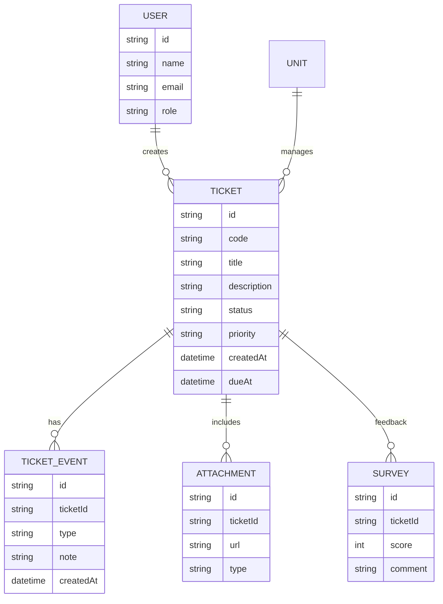

# MFU Repair Request System — Specification (spec.md)

## 1. Overview
ระบบแจ้งซ่อมภายในมหาวิทยาลัยแม่ฟ้าหลวง (Mae Fah Luang University)  
ออกแบบเพื่อให้ **นักศึกษาและบุคลากร** สามารถแจ้งซ่อมอุปกรณ์หรือสิ่งของต่าง ๆ ได้สะดวก พร้อมระบบติดตามงานซ่อมแบบมี SLA และ Dashboard สำหรับหัวหน้างานและผู้บริหาร

---

## 2. Objectives
- ลดความซ้ำซ้อนของการแจ้งซ่อม และติดตามงานได้แบบเรียลไทม์  
- เชื่อมโยงหน่วยงานที่เกี่ยวข้อง เช่น ศูนย์ไอที, ส่วนอาคาร, ฝ่ายโสต  
- มีระบบ SLA, การมอบหมายงาน, การประเมินความพึงพอใจ  
- แสดงผลผ่าน Dashboard เพื่อวิเคราะห์คุณภาพการให้บริการและทรัพยากรของหน่วยงาน

---

## 3. User Roles
| Role | Description | Permissions |
|------|--------------|--------------|
| Reporter | นักศึกษา / บุคลากร ผู้แจ้งซ่อม | สร้าง ticket, ติดตามสถานะ, ให้คะแนน |
| Helpdesk | รับเรื่องเบื้องต้น | ตรวจสอบ หมวด ปัญหา และกำหนดหน่วยงาน |
| Technician | ช่างซ่อมแต่ละหน่วย | รับงาน, อัปเดตสถานะ, แนบรูปหลังซ่อม |
| Team Lead | หัวหน้าฝ่าย | มอบหมาย / ย้ายงาน / ตรวจสอบ SLA |
| Manager | หัวหน้าหน่วยงาน | ตรวจสอบภาพรวมของหน่วย |
| Executive | รองอธิการ / มหาวิทยาลัย | ดูสถิติรวม, Dashboard |
| System Admin | ผู้ดูแลระบบ | ตั้งค่า category, SLA, users, permissions |

// Mark
| User | 
| Technician | 
| Supervisor | 
| Executive | 
| Admin |

---

## 4. Features
### 4.1 แจ้งซ่อม (Create Ticket)
- ฟอร์มกรอกหมวดปัญหา เช่น  
  - ไฟฟ้า / ประปา / เครื่องเสียง / คอมพิวเตอร์ / Wi-Fi / ครุภัณฑ์ / อาคาร / อื่น ๆ  
- รายละเอียดปัญหา + ภาพถ่าย / วิดีโอแนบ  
- สถานที่: อาคาร / ชั้น / ห้อง  **Optional: เก็บพิกัดจาก GPS**
- หมายเลขครุภัณฑ์ (ถ้ามี)  **Optional: Scan barcode/qr code**
- ระบบจะสร้าง Ticket ID อัตโนมัติ (เช่น MFU-YYYYMM-0001)
- ระบบให้ผู้ใช้กรอกข้อมูลเบอร์โทร และ email ของผู้ใช้ สำหรับการติดต่อกลับ และสามารถบันทึกเพื่อเก็บไว้กรอกอัตโนมัติในครั้งถัดไป

### 4.2 Routing & Assignment
- ระบบแมปหน่วยงานอัตโนมัติจากหมวดปัญหา  **ถ้าไม่พบหน่วยงานที่เกี่ยวข้อง ระบบจะส่งไปยังหน่วยงานที่กำหนดใน config**
-- น้ำ ไฟ ครุภัณฑ์ อาคาร ส่งไปส่วนอาคาร
-- WiFi อินเตอร์เน็ต คอมพิวเตอร์ ส่งไปศูนย์ไอที
-- เครื่องเสียง ทีวี LCD-Projector ส่วนไปฝ่ายโสต ศูนย์บริการวิชาการ
- หัวหน้างานสามารถ “มอบหมาย” ช่าง หรือ “ย้ายหน่วย” ได้  
- บันทึก audit ทุกการเปลี่ยนแปลง

### 4.3 SLA Tracking
| Priority | Response Time | Resolve Time |
|-----------|----------------|---------------|
| P1 (ฉุกเฉิน) | 15 นาที | 4 ชม. | ** เช่นน้ำรั่ว ไฟฟ้าลัดวงจร **
| P2 (สูง) | 1 ชม. | 8 ชม. | ** เช่น ปัญหาอุปกรณ์ต่าง ๆ ที่ต้องการเร่งด่วน **
| P3 (ปกติ) | 4 ชม. | 3 วันทำการ | ** เช่น ปัญหาอุปกรณ์ต่าง ๆ มีปัญหา แต่ยังพอทำงานได้ รอได้ **
| P4 (ผ่อนผัน) | 1 วัน | 7 วันทำการ | ** เช่น เคสชำรุดเสียหาย ที่รอได้ ไม่มีความสูญเสียร้ายแรง **

- มีระบบแจ้งเตือนเมื่อใกล้ครบ SLA (80%) และเมื่อเกินกำหนด แจ้งเตือนไปยังช่าง และหัวหน้างาน

### 4.4 งานช่าง (Technician)
- ดูรายการงานใน My Jobs  
- บันทึกเวลาเริ่ม/จบ, แนบภาพก่อน-หลังซ่อม  
- สามารถ Pause / Resume / Resolve งานได้
- กรณีที่ไม่สามารถจบงานตาม SLA ต้องรายงานและระบุวันที่คาดว่าจะแก้ไขแล้วเสร็จ และระบบส่งกลับไปให้ผู้แจ้งรับทราบ รวมถึงแจ้งเตือนไปยังหัวหน้างาน

### 4.5 ความพึงพอใจ
- หลังปิดงาน ระบบส่งแบบประเมิน 1–5 ดาว พร้อมช่องความคิดเห็น  เพื่อให้ผู้ใช้ประเมินความพึงพอใจ หลังจากงานเสร็จสิ้น กรณีที่ไม่ประเมิน จะไม่สามารถส่งแจ้งครั้งต่อไปได้ ระบบจะแจ้งเตือนการค้างประเมิน
- บันทึกผลลง Dashboard

### 4.6 Dashboard
- สถิติรวมทุกหมวด / หน่วยงาน / ช่าง  
- SLA compliance %, MTTA/MTTR, CSAT, จำนวนงานคงค้าง  
- Heatmap อาคาร / ชั้น / พื้นที่ซ่อมบ่อย  
- Export CSV/Excel ได้
** MTTA – Mean Time to Acknowledge เวลาเฉลี่ยตั้งแต่ลูกค้าหรือผู้ใช้แจ้งปัญหา → จนช่างหรือเจ้าหน้าที่ตอบรับงาน
** MTTR – Mean Time to Resolve เวลาเฉลี่ยตั้งแต่ช่างหรือเจ้าหน้าที่ตอบรับงาน → จนงานเสร็จสิ้น
** CSAT – Customer Satisfaction ความพึงพอใจของลูกค้า
---

## 5. Workflow
```
NEW → TRIAGE → ASSIGNED → IN_PROGRESS → RESOLVED → CLOSED
           ↘ REASSIGNED / ON_HOLD / CANCELLED
```

---

## 6. Data Model (Simplified)


---

## 7. REST API Summary
| Method | Endpoint | Description |
|--------|-----------|-------------|
| `POST /api/tickets` | สร้าง ticket ใหม่ |
| `GET /api/tickets` | ดึงรายการทั้งหมด (filter ได้) |
| `GET /api/tickets/:id` | ดึงรายละเอียด |
| `PATCH /api/tickets/:id` | เปลี่ยนสถานะ / มอบหมาย / เพิ่มหมายเหตุ |
| `POST /api/tickets/:id/attachments` | แนบไฟล์ |
| `POST /api/tickets/:id/survey` | บันทึกความพึงพอใจ |
| `GET /api/dashboard` | สรุปข้อมูลรายหน่วย / ผู้บริหาร |
| `GET /api/config/categories` | รายการหมวดแจ้งซ่อม |

---

## 8. Sample JSON (Ticket)
```json
{
  "id": "MFU-202510-0012",
  "title": "ปลั๊กไฟชำรุดในห้องเรียน",
  "description": "ปลั๊กไฟหลวม เสี่ยงไฟดูด",
  "category": "ไฟฟ้า",
  "priority": "P2",
  "status": "ASSIGNED",
  "unit": "ส่วนอาคารสถานที่",
  "assignee": "นายสมชาย ช่างไฟ",
  "sla": {
    "responseBy": "2025-10-21T10:15:00Z",
    "resolveBy": "2025-10-21T18:00:00Z"
  }
}
```

---

## 9. Frontend Requirements
- Framework: **Next.js (App Router)**  
- State: React Query / Zustand  
- UI: shadcn/ui  
- Form: React Hook Form + Zod  
- File Upload: ใช้ Signed URL (S3/Minio)  
- Auth: OIDC (MFU SSO)  
- Responsive PWA + Dark Mode  
- Role-based views:
  - Reporter: My Tickets, New Ticket  
  - Lead: Team Board, SLA Alerts  
  - Exec: Dashboard Overview  

---

## 10. Backend Requirements
- Framework: **NestJS + Prisma + PostgreSQL**  
- Scheduler: BullMQ (SLA monitor)  
- Notification: Email + Webhook (LINE OA ภายหลัง)  
- Logging: Winston / OpenTelemetry  
- RBAC: Guards & Policies  
- File Storage: S3-compatible  

---

## 11. Non-Functional
- SLA Monitor every 5 min  
- Response time < 600ms  
- Audit Log ครบทุกการเปลี่ยนสถานะ  
- รองรับ multi-campus / multi-building  
- มีระบบสำรองข้อมูลรายวัน  

---

## 12. Example Prompts for GitHub Copilot

**Frontend Form**
> Generate a Next.js page `/app/tickets/new` with fields title, description, category, priority, location, attachments, using React Hook Form + shadcn/ui, and POST to `/api/tickets`.

**Backend Controller**
> Create a NestJS controller `tickets.controller.ts` with routes POST/GET/PATCH according to spec.md. Use Prisma and emit TicketEvent for each status change.

---

## 13. Initial Categories (seed)
```json
[
  {"name": "ไฟฟ้า", "unit": "Facility"},
  {"name": "ประปา/น้ำ", "unit": "Facility"},
  {"name": "เครื่องเสียง/โสต", "unit": "AV"},
  {"name": "คอมพิวเตอร์", "unit": "CITS"},
  {"name": "WiFi/อินเทอร์เน็ต", "unit": "CITS"},
  {"name": "ครุภัณฑ์", "unit": "Facility"},
  {"name": "อาคาร/สถานที่", "unit": "Facility"},
  {"name": "อื่นๆ", "unit": "Helpdesk"}
]
```

---

## 14. Future Roadmap
- AI Auto Categorization (Vision/NLP)  
- Technician mobile app (offline-first)  
- Spare-part inventory link  
- Public outage board  
- Power BI integration  

---

**End of spec.md**
